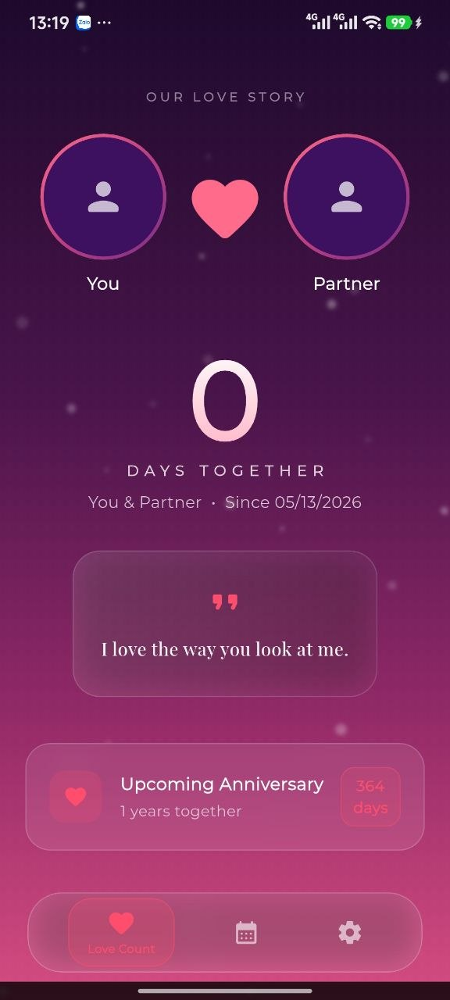
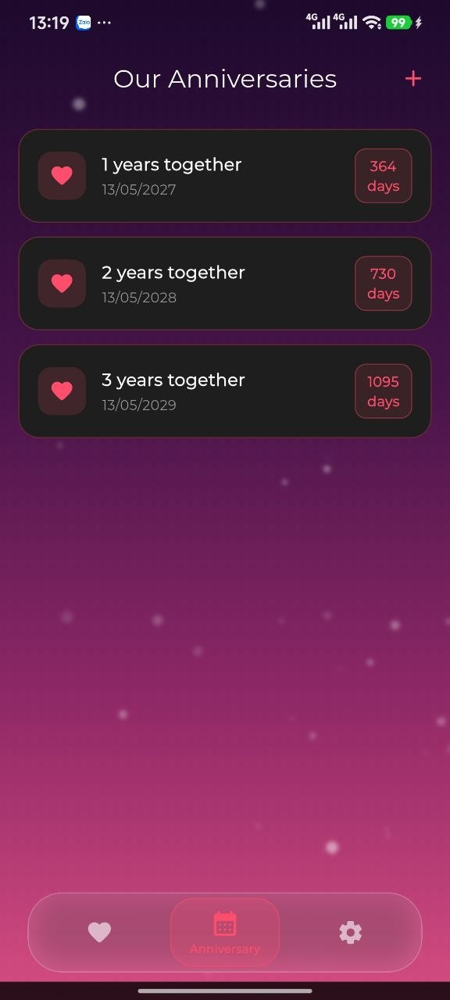
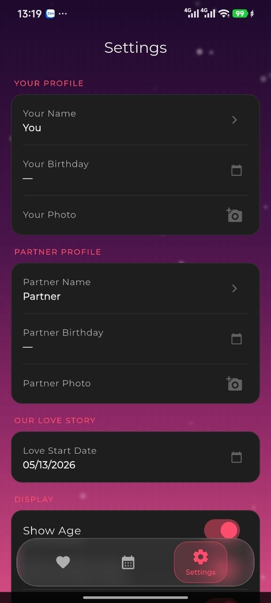

<div align="center">
  
  
  # Amordaily 💖
  
  **A beautifully crafted, minimalist, and feature-rich love days counter application.**
  
  [](https://flutter.dev/)
  [](https://dart.dev/)
  [](#)
  [](#-important-disclaimer)
  [](#-contributing)
</div>

<hr>

## ⚠️ Important Disclaimer

> **🛑 NON-COMMERCIAL USE ONLY**  
> This application is developed entirely for **educational, research, and community-service purposes**.  
> **IT IS STRICTLY PROHIBITED TO USE THIS SOURCE CODE FOR COMMERCIAL PURPOSES OR MONETIZATION.**  
> 
> This project is open-sourced to help developers learn Flutter and build applications that bring emotional value. Any attempt to re-skin, publish for profit, or commercialize this repository goes strictly against the author's core principles and licensing.

<hr>

## 📖 Table of Contents
- [About the Project](#-about-the-project)
- [Key Features](#-key-features)
- [Screenshots](#-screenshots)
- [Tech Stack](#-tech-stack)
- [Architecture & Directory Structure](#-architecture--directory-structure)
- [Getting Started](#-getting-started)
- [Testing](#-testing)
- [Contributing](#-contributing)

<hr>

## 💡 About the Project

**Amordaily** is more than just a day counter; it is a digital scrapbook for couples. Designed with a stunning **Glassmorphism** aesthetic and fluid animations, it provides a safe, offline, and beautiful space to track relationship milestones, celebrate anniversaries, and cherish every moment together.

## ✨ Key Features

*   ⏱️ **Precision Love Counter:** Accurately track the exact days, months, and years you've been together.
*   🎨 **Immersive Glassmorphism UI:** A breathtaking, modern interface featuring blur effects, dynamic gradients, and ambient particle animations.
*   🔐 **100% Offline & Private:** Zero tracking. Zero servers. All data is securely stored locally on your device via `SharedPreferences`.
*   🎭 **Customizable Profiles:** Personalize the experience with custom names, avatars, and birthdates.
*   🔮 **Smart Astrological Integration:** Automatically calculates age and displays beautiful zodiac signs based on partner birthdates.
*   📅 **Advanced Milestone Tracking:** Save important dates (first kiss, engagement, etc.) and view an interactive countdown to upcoming anniversaries.
*   💌 **Curated Love Quotes:** A massive built-in database of romantic quotes that updates daily to warm your heart.
*   🌍 **Native Multi-language Support:** Carefully localized in 6 languages: 
    *   🇬🇧 English
    *   🇻🇳 Vietnamese
    *   🇷🇺 Russian
    *   🇯🇵 Japanese
    *   🇰🇷 Korean
    *   🇨🇳 Chinese

## 📸 Screenshots

| Home Screen | Anniversary Tracker | Settings & Profile |
|:---:|:---:|:---:|
|  |  |  |

## 🛠 Tech Stack

This project leverages modern Flutter development practices to ensure high performance and maintainability:

- **Core:** Flutter SDK, Dart
- **State Management:** `provider` (Clean, scalable reactive state)
- **Data Persistence:** `shared_preferences` (Lightweight local storage)
- **UI/UX Dependencies:** 
  - `google_fonts` (Typography)
  - Custom painters for particle backgrounds and glassmorphism.
- **Testing:** `flutter_test` (Unit, Widget, and Model consistency testing)

## 🏗 Architecture & Directory Structure

The codebase follows a clean, feature-driven architecture:

```text
lib/
├── main.dart                 # Application entry point
├── providers/
│   └── love_provider.dart    # Core business logic & state management
├── screens/
│   ├── home_screen.dart      # Main dashboard & counter
│   ├── anniversary_screen.dart # Milestone tracking UI
│   └── settings_screen.dart  # Profile & app configuration
├── utils/
│   ├── app_localizations.dart # Multi-language engine
│   ├── constants.dart        # Theme colors, text styles
│   └── quotes_data.dart      # Localized quotes database
└── widgets/
    ├── custom_bottom_nav.dart # Glassmorphic navigation bar
    └── particle_background.dart # Ambient animated background
```

## 🚀 Getting Started

Follow these instructions to get a copy of the project up and running on your local machine.

### Prerequisites
- [Flutter SDK](https://docs.flutter.dev/get-started/install) (v3.10.0 or higher)
- Android Studio / Xcode for emulators

### Installation

1. **Clone the repository:**
   ```bash
   git clone https://github.com/vietnq191/amordaily-app.git
   ```

2. **Navigate to the project directory:**
   ```bash
   cd amordaily-app
   ```

3. **Fetch dependencies:**
   ```bash
   flutter pub get
   ```

4. **Run the application:**
   ```bash
   flutter run
   ```

## 🧪 Testing

We take code quality seriously. Amordaily comes with a robust, automated test suite covering UI components, state management, data integrity, and localization consistency.

To execute the test suite:
```bash
flutter test
```

## 🤝 Contributing

We believe in the power of open-source community! If you have suggestions to improve the app, please follow these steps:

1. Fork the Project
2. Create your Feature Branch (`git checkout -b feature/AmazingFeature`)
3. Commit your Changes (`git commit -m 'Add some AmazingFeature'`)
4. Push to the Branch (`git push origin feature/AmazingFeature`)
5. Open a Pull Request

---
<div align="center">
  <i>Crafted with ❤️ for the community.</i>
</div>
